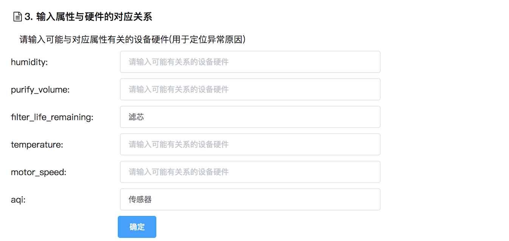

## 系统使用说明

系统需要机器安装Java环境、Python环境、配置HomeAssistant环境。web展示使用vue框架，server端使用SpringBoot进行部署。使用步骤如下：

1. 将设备接入Home Assistant。
2. 配置代码目录中Utils/Constants的文件路径、系统参数等信息。
3. 加湿器与净化器的ServiceName类无须填写，新设备需要将操作名称手动写入到这个类中。
4. 运行SmarthomeApplication类开启server。
5. 执行frontend/run.sh获取前端页面ip地址，浏览器输入该ip地址，接下来可以按照页面提示步骤进行使用。

## 前后端交互过程

## 前端（系统UI）

**frontend**包里是前端Vue代码，frontend/src/components/List.vue是主要的显示页代码。前端显示共分为四部分：

1. 属性获取：由用户输入实体名称，可以“获取过滤后的设备属性”，用户可以进一步对属性进行筛选，然后点击“开始构建模型”；
2. 模型构建：模型变化图会实时展示在界面上，结束之后可以开始异常检测与定位。
3. 输入属性与功能部件对应关系。

4. 按运行模式，实时展示属性数据。
5. 实时汇报异常检测定位信息。

List.vue中代码主要是根据以上各部分进行区分展示，同时会对后端接收的数据进行简单处理。

run.sh是前端代码执行脚本，脚本执行之后会在控制台显示页面的ip地址，可直接访问。浏览器中输入下面地址，可以到达系统UI界面。

## 后端（模型与异常检测定位实现）

代码在src.main.java.com.iscas.smarthome中，各个包的作用：

**controller：**接收前端请求，进行简单处理之后，交由具体的处理逻辑进行处理，并返回给前端相应的处理结果。

**data：**用于异常检测算法的曲线相似度比较，主要是将一些统计值表示成对象。

**figures：**用于生成python图，其中包括一些python画图脚本，以及调用python脚本的java程序。

**graphviz：**通过graphviz生成模型的可视图。

**homeassistant：**与HomeAssistant交互的一些脚本，call_service.py用于调用操作，get_attribute.py用于获取属性值。HASript和Caller类是用于调用python脚本的java类。AttributesName、EntityName、ServiceName是通过HomeAssistant获取设备信息之后，填写的一些设备信息。

**specification：**主要是设备与对应的模式、操作记录信息，可以将这些信息序列化起来，避免每次重新获取信息。

**stateautomaton：**包括attribute、graph、state三个包，模型的表示信息与构建更新过程。

**test：**将整体运行过程分为BuildGraphPhase和CheckDataPhase，两者都是以线程形式规范的，其中会通过计时器定时进行相应的处理与更新过程。

**Utils：**一些静态方法，包括一些路径常量、参数常量、文件处理方法、相似度计算方法、计时器、日期处理方法等。

**websocket：**前后端传输信息的长连接表示，通过自定义的websocket类可以在前后端之间传输相应的文本信息。

**SmarthomeApplication类：**server入口，对系统进行初始化过程，然后可以与前端进行交互。

